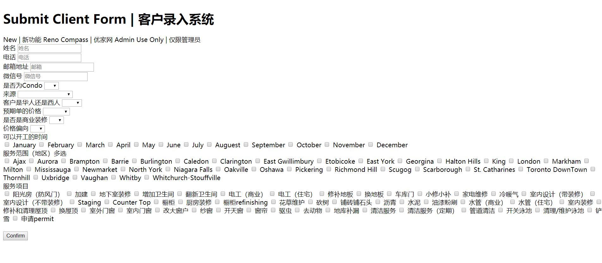

# js-form-validation
 This is a form validation js file. Jquery, json are used in order to validate field.
 Only the html are included in this repo without css.
 This is what it looks like:
 
 
### Installing

A step by step series of examples that tell you how to get a development env running

1.clone this repo 

2.open up index.html and fill in the form. For the validation to work press submit.
